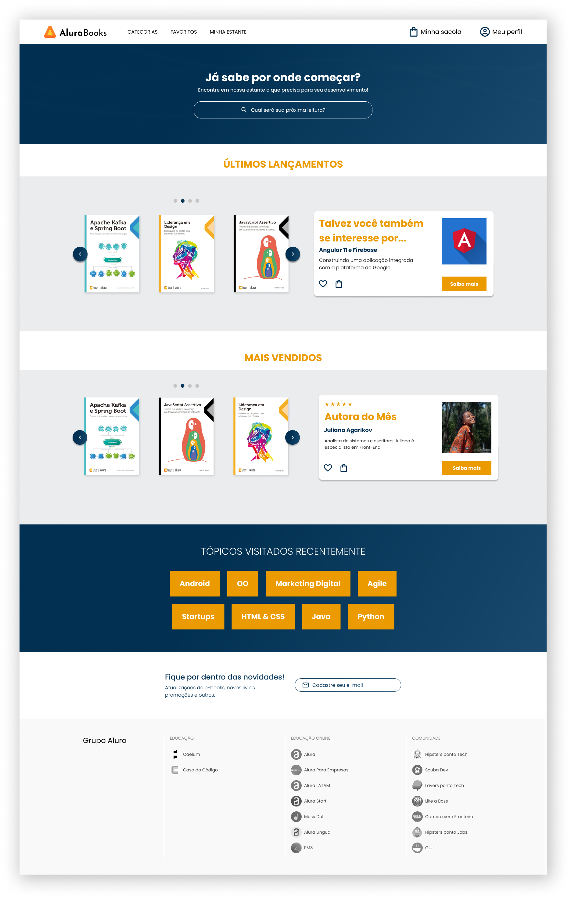

<h1 align="center"> AluraBooks </h1>

AluraBooks - Uma loja virtual de livros de tecnologia 

  

 

## 🚀 Tecnologias

Esse projeto foi desenvolvido com as seguintes tecnologias:

- HTML e CSS
- API Swiper JS
- Git e Github
- Figma

## 💻 Projeto

A loja de livros online AluraBooks, desenvolvida inteiramente com HTML e CSS, inclusive o menu hamburguer, usando somente o swiper js para criar o carrossel presente no site. 
O site foi desenvolvido com o conceito Mobile-first, para que o usuario tem acesso em todos os dispositivos.

- [Visite o projeto online]()

## 🔖 Layout

Você pode visualizar o layout do projeto através [DESSE LINK](https://www.figma.com/file/sSMbIqKaGBd66Y8roxTk2p/AluraBooks?node-id=113%3A1553&t=pKSDav1hsDU2spF3-0). É necessário ter conta no [Figma](https://figma.com) para acessá-lo.
